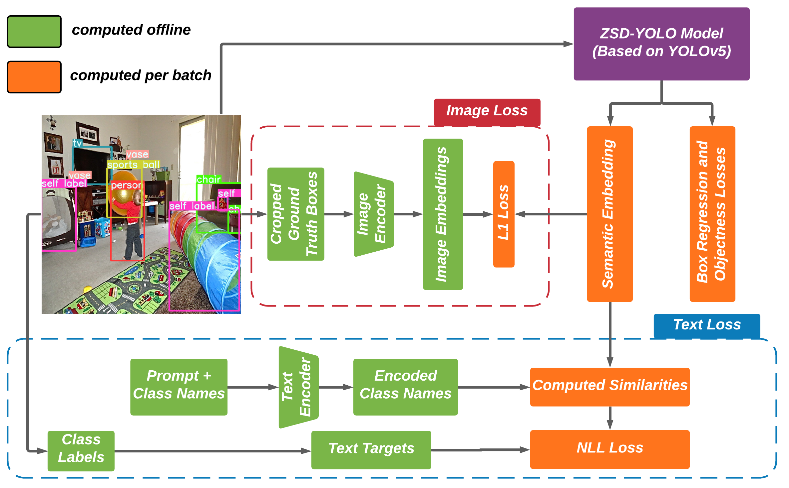

## Introduction


**ZSD-YOLO** is a zero-shot detector initially described in [this paper](https://arxiv.org/abs/2109.12066) based on the popular [**YOLOv5**](https://github.com/ultralytics/yolov5) detector that leverages [**CLIP**](https://github.com/openai/CLIP) vision language models to perform embedding alignment. Our [paper](https://arxiv.org/abs/2109.12066) describes a self-labeling method and modified nms operation tailored to the zero-shot detection (ZSD) problem also implemented in this repository.

**ZSD-YOLO** achieves state-of-the-art performance across three main ZSD benchmarks while also being significantly more lightweight.

## Getting Started
<details open>
<summary>Install</summary>

[**Python>=3.6.0**](https://www.python.org/) is required with all
[requirements.txt] installed including
[**PyTorch>=1.7**](https://pytorch.org/get-started/locally/):

```bash
$ git clone https://github.com/Johnathan-Xie/ZSD-YOLO
$ cd ZSD-YOLO
$ pip install -r requirements.txt
$ pip install git+https://github.com/openai/CLIP.git
```
</details>
<details open>
<summary>Download</summary>
    
Datasets are setup in typical [**YOLOv5**](https://github.com/ultralytics/yolov5) format with paired image, label folders, and a .yaml metadata file, except in our repository labels are stored in torch .pt files to allow for offline image embedding computation.

All data, model_checkpoints, and embeddings can be found at [this kaggle dataset link](https://www.kaggle.com/datasets/johnathanxie/zsd-yolo). Download and place the folders in their corresponding locations (your local repository layout should match the layout of the kaggle repository). Alternatively you can just download the entire repository from the kaggle link and follow the above install instructions for all the functionality.


## Testing Examples
<details>
<summary>COCO</summary>
<summary>Zero Shot Detection (ZSD) mAP</summary>

```bash
$ python3 test.py --weights weights/model_checkpoints/yolov5x_coco_65_15_zsd_self.pt --data data/coco/coco_zsd_2014_test_65_15.yaml --img 640 --save-json --zsd --annot-folder labels2014_zsd_self_test_l_65_15 --obj-conf-thresh 0.1 --batch-size 20 --iou-thres 0.4 --conf-thres 0.001 --max-det 15 --verbose --exist-ok --plot-conf 0.1
                                                           5s      48_17                                                 48_17                                                                            48_17
                                                           5m
```

<summary>Generalized Zero Shot Detection (GZSD) mAP</summary>

```bash
$ python3 test.py --weights weights/model_checkpoints/yolov5x_coco_65_15_zsd_self.pt --data data/coco/coco_gzsd_2014_65_15.yaml --img 640 --save-json --zsd --annot-folder labels2014_gzsd_65_15 --obj-conf-thresh 0.1 --batch-size 20 --iou-thres 0.4 --conf-thres 0.001 --max-det 45 --text-embedding-path embeddings/all_coco_text_embeddings_65_15.pt --eval-splits unseen_names seen_names --verbose --exist-ok --plot-conf 0.1 --eval-by-splits
                                                                   48_17                                             48_17                                                                 48_17                                                                                                                                                 48_17
                                                           
```
</details>
<details>
<summary>ILSVRC</summary>

```bash
$ python3 test.py --weights weights/model_checkpoints/yolov5x_ilsvrc_zsd_self.pt --data data/ILSVRC/ilsvrc_zsd_test.yaml --annot-folder ilsvrc_zsd_labels --zsd --batch-size 32 --verbose --max-det 2 --iou-thres 0.4 --obj-conf-thresh 0.2 --plot-conf 0.3 --img 320
```
</details>

</details>
<details>
<summary>VG</summary>

```bash
$ python3 test.py --weights weights/model_checkpoints/yolov5x_vg_zsd_self.pt --data data/vg/vg_zsd_test.yaml --annot-folder labels_zsd_test --zsd --batch-size 12 --verbose --max-det 100 --iou-thres 0.4 --obj-conf-thresh 0.01 --plot-conf 0.01
```
</details>

## Training Examples
<details>
<summary>COCO</summary>

```bash
$ python3 train.py --data data/coco/coco_zsd_2014_val_65_15.yaml --weights weights/pretrained_weights/yolov5x_coco_65_15_pretrain.pt --cfg models/yolov5x-ZSD-65-15.yaml --hyp hyp.finetune_coco_zsd_self_evolved.yaml --annot-folder labels2014_zsd_self_val_l_65_15 --epochs 50 --zsd --batch-size 12 --verbose --max-det 15 --iou-thres 0.4 --workers 12 --obj-conf-thresh 0.1 --plot-conf 0.1
                                                  test_48_17.yaml                                          5m                                          5m     48-17                                                                                       test_l_48_17                                                                                                                     
                                                                                                           5s                                          5s
                                                                                                           3                                           3
```
Note: For COCO 65/15 training, results will be shown for our proposed validation set. For true ZSD testing results, run the testing experiment with the test set shown above.
</details>

<details>
<summary>ILSVRC</summary>

```bash
$ python3 train.py --data data/ILSVRC/ilsvrc_zsd_test.yaml --weights weights/pretrained_weights/yolov5x_zsd_ilsvrc_pretrain.pt --cfg models/yolov5x-ZSD-ILSVRC.yaml --hyp hyp.finetune_coco_zsd_self_evolved.yaml --annot-folder ilsvrc_zsd_labels --epochs 50 --zsd --batch-size 32 --iou-thres 0.4 --workers 12 --obj-conf-thresh 0.2 --plot-conf 0.3 --img-size 320 --max-det 2
```
</details>

<details>
<summary>VG</summary>

```bash
$ python3 train.py --data data/vg/vg_zsd_test.yaml --weights weights/pretrained_weights/yolov5x_vg_pretrain.pt --cfg models/yolov5x-ZSD-VG.yaml --hyp hyp.finetune_vg_zsd_self.yaml --annot-folder labels_zsd_test --epochs 100 --zsd --batch-size 12 --verbose --max-det 100 --iou-thres 0.4 --workers 12 --obj-conf-thresh 0.01 --plot-conf 0.01
```
</details>

## Citing ZSD-YOLO

```
@article{DBLP:journals/corr/abs-2109-12066,
  author    = {Johnathan Xie and
               Shuai Zheng},
  title     = {{ZSD-YOLO:} Zero-Shot {YOLO} Detection using Vision-Language KnowledgeDistillation},
  journal   = {CoRR},
  volume    = {abs/2109.12066},
  year      = {2021},
  url       = {https://arxiv.org/abs/2109.12066},
  eprinttype = {arXiv},
  eprint    = {2109.12066},
  timestamp = {Mon, 27 Sep 2021 15:21:05 +0200},
  biburl    = {https://dblp.org/rec/journals/corr/abs-2109-12066.bib},
  bibsource = {dblp computer science bibliography, https://dblp.org}
}
```
